#  Library System with Geolocation (REMED UCP 1 - PAW)

Sistem Manajemen Perpustakaan sederhana berbasis web yang dilengkapi dengan fitur Geolocation untuk mencatat lokasi pengguna saat melakukan peminjaman buku. 

## 🚀 Fitur Utama

1.  **Autentikasi User & Admin**: Login dan Register dengan pembagian hak akses (Role-based Access Control).
2.  **Manajemen Buku (CRUD)**: Admin dapat melihat, menambah, mengedit, dan menghapus data buku.
3.  **Peminjaman Berbasis Lokasi**: User dapat meminjam buku, dan sistem otomatis mencatat koordinat (Latitude & Longitude) pengguna.
4.  **Laporan Peminjaman**: Admin dapat melihat riwayat peminjaman beserta link Google Maps lokasi peminjaman.
5.  **Pencarian Real-time**: Fitur pencarian buku berdasarkan judul atau penulis tanpa reload halaman.

## 🛠️ Teknologi yang Digunakan

* **Backend**: Node.js, Express.js
* **Database**: MySQL, Sequelize ORM
* **Frontend**: HTML5, Bootstrap 5, Vanilla JavaScript (Fetch API)
* **Tools**: Postman (Testing API), VS Code

## 📂 Struktur Proyek

REMED-PAW/
├── config/             # Konfigurasi Database
├── models/             # Definisi Tabel (User, Book, BorrowLog)
├── routes/             # Endpoint API
├── middleware/         # Middleware Autentikasi Role
├── public/             # Frontend (HTML, CSS, JS)
└── server.js           # Entry Point Server

Cara Menjalankan aplikasi

1. Prasyarat
Pastikan sudah menginstal:

- Node.js

- MySQL Workbench

2. Instalasi Dependency
Buka terminal di folder proyek dan jalankan:
Bash -
# npm install

3. Konfigurasi Database

Buat database baru bernama library_geo_db di MYSQL Workbench.

Buka file config/database.js dan sesuaikan konfigurasi (jika ada password):

# const sequelize = new Sequelize('library_geo_db', 'root', '', { ... });

4. Jalankan Server
Bash -
node server.js
Jika berhasil, akan muncul pesan:

🚀 Server berjalan di http://localhost:3000 ✅ Database terhubung & Relasi sinkron.

5. Akses Aplikasi
Buka browser dan kunjungi: http://localhost:3000

# TEST ENDPOINT API

- Publik
1. GET /api/books : Melihat semua buku.
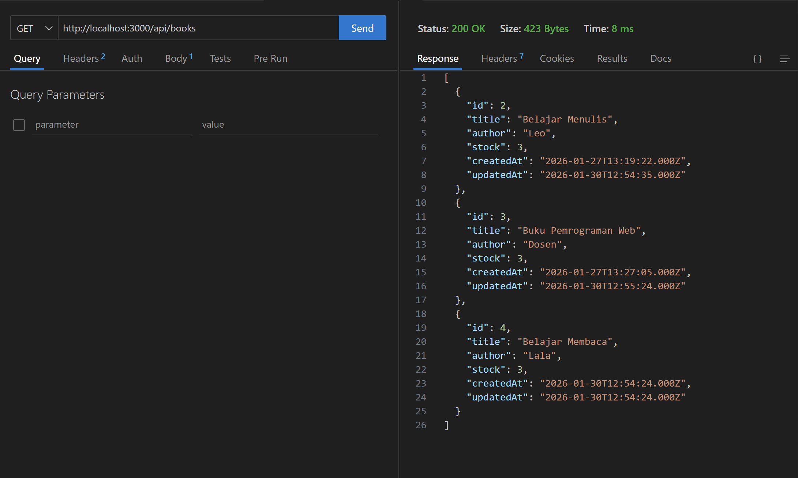

2. GET /api/books/:id : Detail buku.
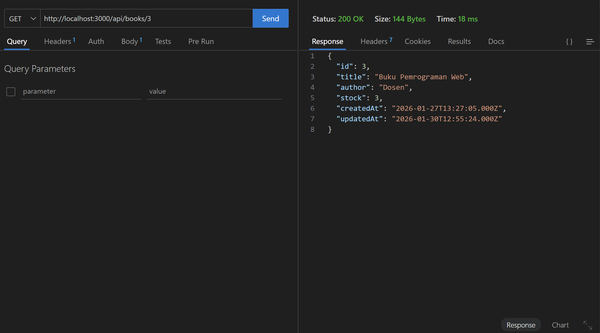

-Admin Mode (Header x-user-role: admin):
1. POST /api/books : Tambah buku baru.
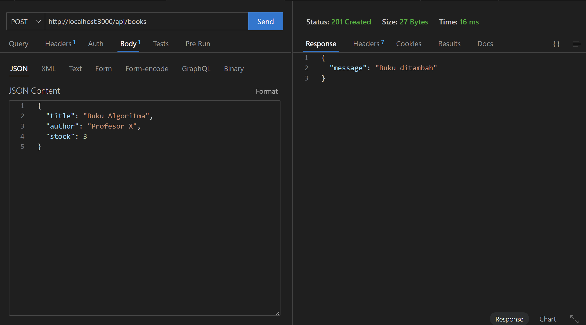

2. PUT /api/books/:id : Update buku.
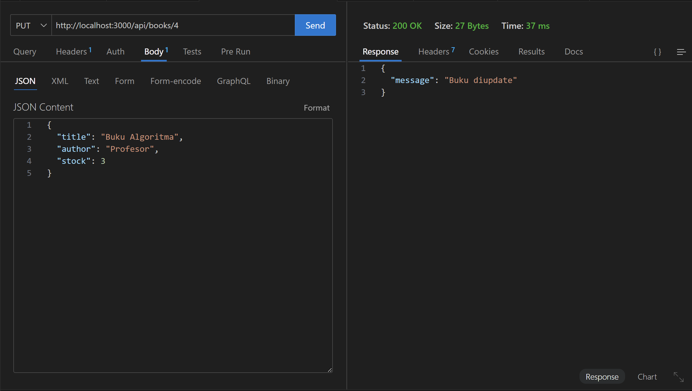

3. DELETE /api/books/:id : Hapus buku.
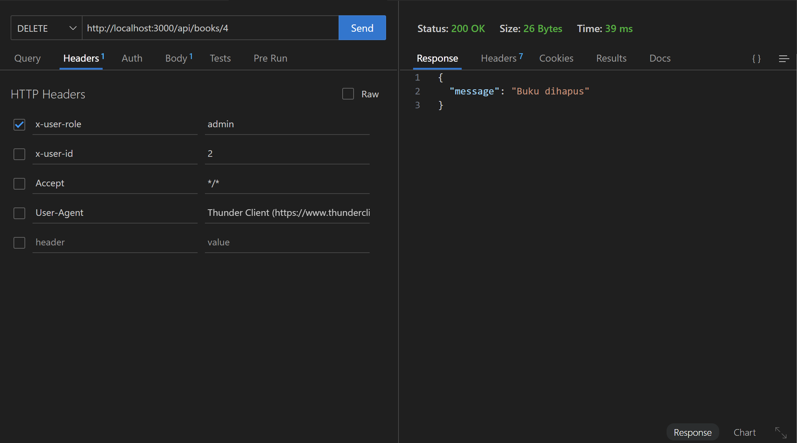

- User Mode (Header x-user-role: user & x-user-id: [id]):
1. POST /api/borrow : Meminjam buku.
▪ Body Payload:
{
 "bookId": 3,
 "latitude": -6.2088,
 "longitude": 106.8456
}

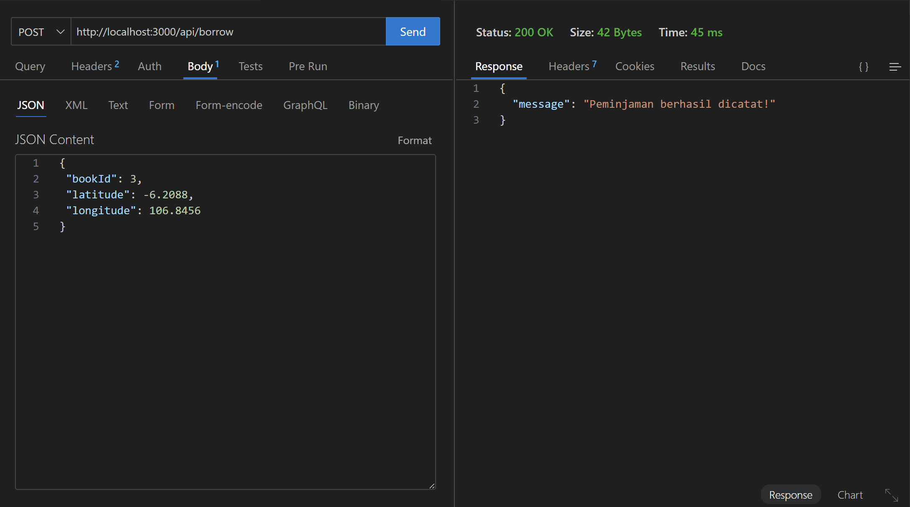

# Tampilan Web
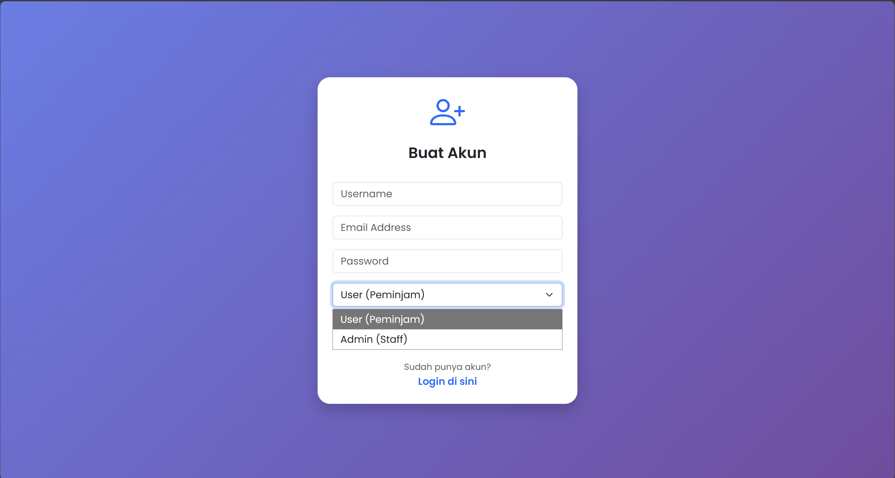
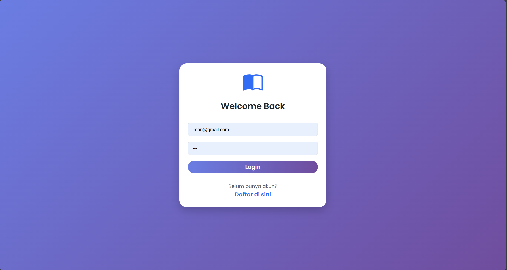
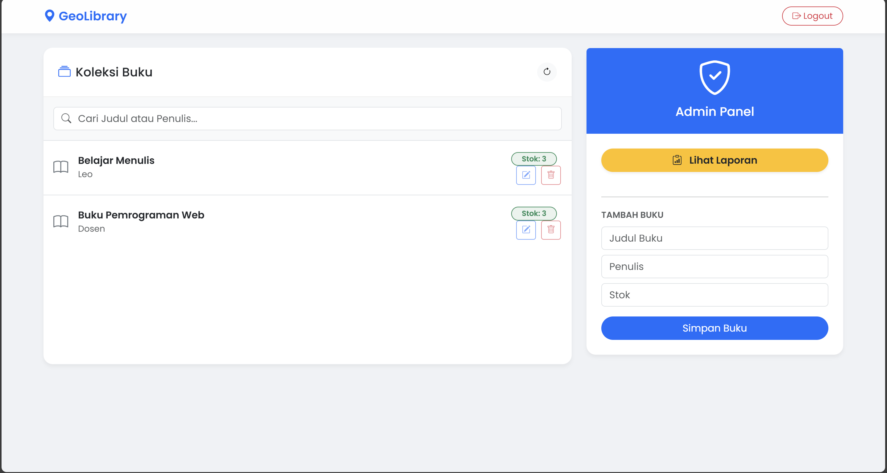
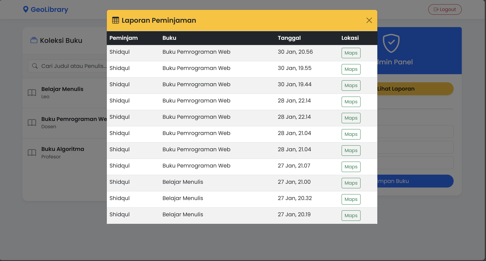
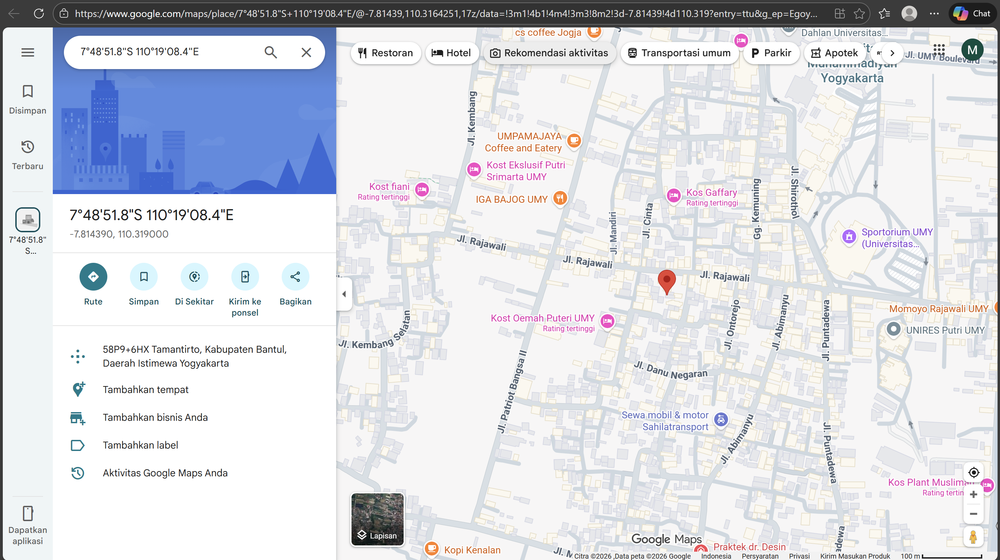
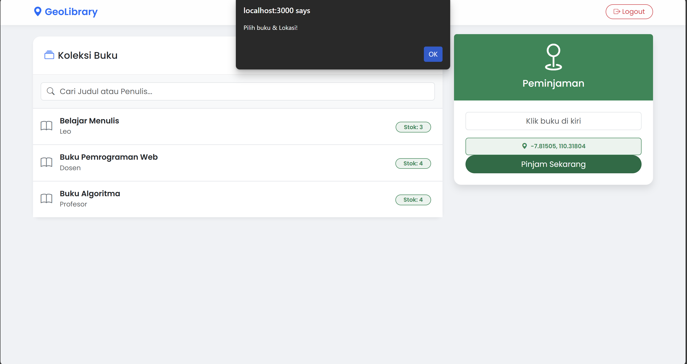

# Struktur Database
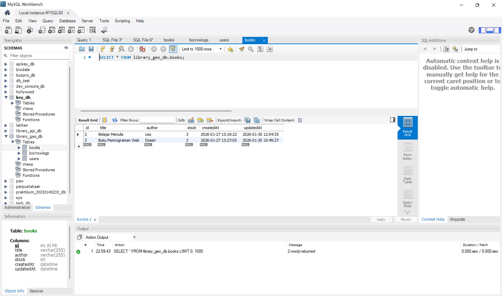
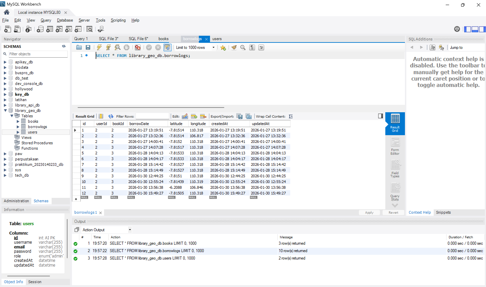
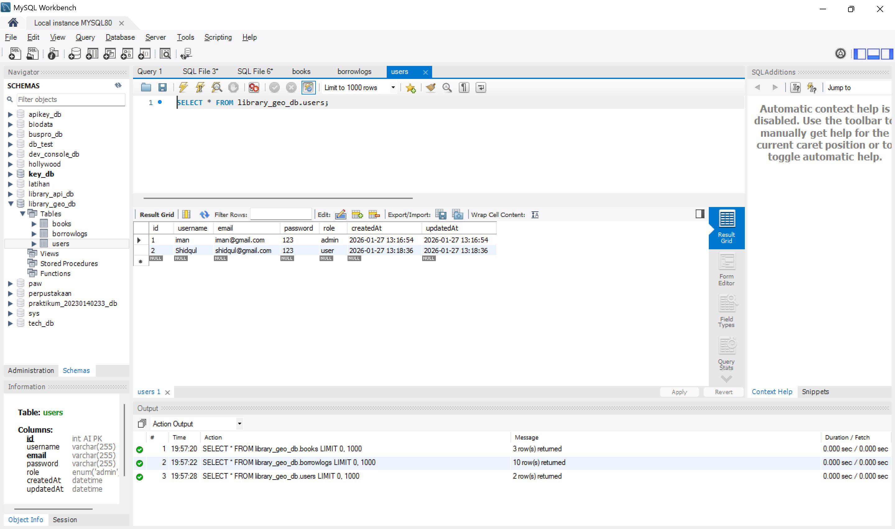